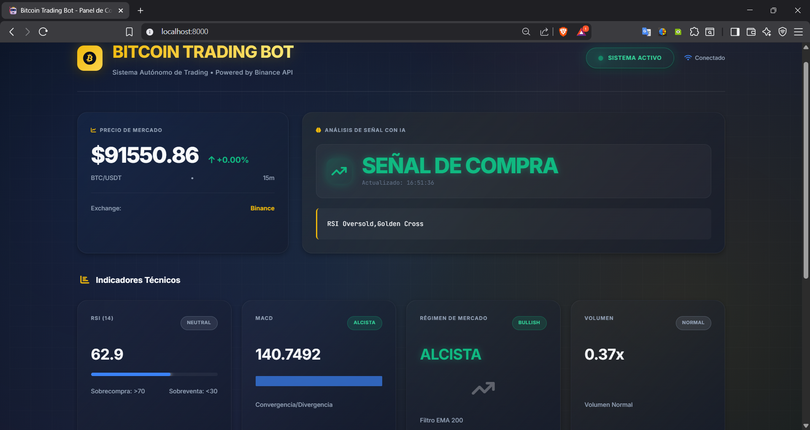
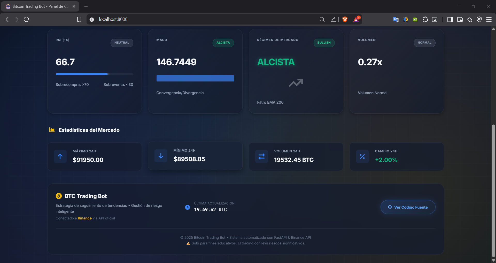

# BTC Trader 🤖

Bot de trading algorítmico de alto rendimiento para el mercado de criptomonedas. Diseñado para operar 24/7 mediante análisis técnico automatizado, gestión de riesgos en tiempo real y arquitectura asíncrona.


> *Dashboard de monitoreo en tiempo real con detección de señales.*

## ⚡ Características Técnicas

### 🧠 Estrategia Cuantitativa
*   **Trend Following**: Implementación de estrategia de cruce de medias y momentum.
*   **Análisis Multi-Factor**: Validación de señales mediante confluencia de **RSI**, **MACD**, **EMA 200** (Régimen de Mercado) y Anomalías de Volumen.
*   **Gestión de Riesgo**: Cálculo automático de Stop Loss y Take Profit dinámicos.

### 🏗️ Arquitectura de Software
*   **Núcleo Asíncrono**: Uso de `asyncio` para ejecutar la lógica de trading y el servidor web simultáneamente sin bloqueos.
*   **Persistencia de Datos**: Sistema de almacenamiento en **SQLite** para mantener el estado de las posiciones ante reinicios del sistema.
*   **API RESTful**: Backend construido con **FastAPI** para exponer métricas al frontend.
*   **Interfaz Reactiva**: Dashboard desarrollado con HTML5/JS Vainilla con actualización vía Polling.

## 🛠️ Stack Tecnológico

*   **Lenguaje**: Python 3.10+
*   **Data Science**: Pandas, NumPy (Vectorización de indicadores).
*   **Conectividad**: CCXT (Exchange Interface), Telegram Bot API.
*   **Web**: FastAPI, Uvicorn, Jinja2.

## 📸 Galería

| Señal de Compra Detectada | Estadisticas Adicionales |
|:---:|:---:|
|  |  |
| *Visualización de señal Long confirmada* | *Información adicional* |

## 🚀 Instalación y Uso

1.  **Clonar repositorio e instalar dependencias:**
    ```bash
    pip install -r requirements.txt
    ```

2.  **Configuración:**
    Renombrar `.env.example` a `.env` y configurar las API Keys (Binance/Telegram).
    *Si no se configuran keys, el bot iniciará en modo "Paper Trading" (Simulación).*

3.  **Ejecutar:**
    ```bash
    python main.py
    ```
    El dashboard estará disponible en `http://localhost:8000`.

 ```
bot_btc/
├── api/                    # Servidor Web (FastAPI)
│   ├── static/             # Archivos CSS e imágenes
│   ├── templates/          # HTML del Dashboard
│   └── server.py           # Endpoints de la API
├── bot/                    # Lógica de Trading
│   ├── exchange.py         # Conexión con Binance/CCXT
│   ├── strategy.py         # Análisis técnico (RSI, MACD, EMA)
│   ├── trader.py           # Ejecución de órdenes
│   └── storage.py          # Base de datos (SQLite)
├── config/                 # Configuraciones
│   └── settings.py         # Variables de entorno
├── screenshots/            # Capturas para el README
├── telegram_bot/           # Notificaciones
├── .env                    # API Keys (No subir a GitHub)
├── .gitignore              # Archivos ignorados
├── main.py                 # Punto de entrada principal
├── requirements.txt        # Dependencias
├── seed_data.py            # Script de inicialización
└── README.md               # Documentación
 ```

## ⚠️ Disclaimer
Este software es para fines educativos y de investigación. El trading de criptomonedas conlleva un alto riesgo financiero. El autor no se hace responsable de pérdidas de capital derivadas del uso de este código.

## 📄 Licencia
MIT License.